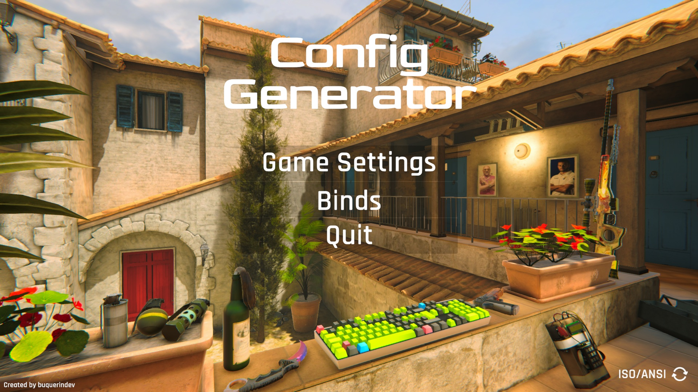

# CS2 Config Generator
This application allows you to save your settings and binds into a .cfg file, it also includes common settings/binds that are not included in the game but are used by professional players

## To Do:

- Enable developer console
- More information and details about some commands (telemetry ms, radio menus...)
- r_gamma
